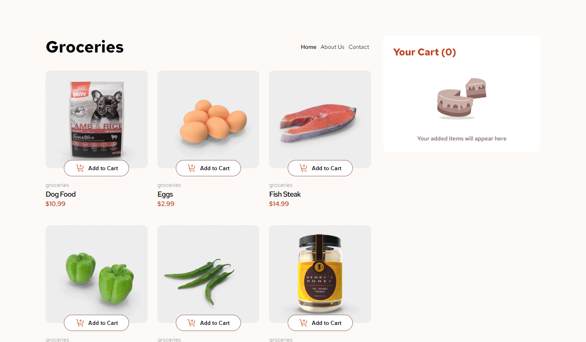

## Vite + React ile Hazırlanan Frontend Mentor Teması

Selamlar, bu projeyi Vite + React kullanarak, frontendmentor.io sitesinde yer alan [_"Product list with cart"_](https://www.frontendmentor.io/challenges/product-list-with-cart-5MmqLVAp_d) teması ile hazırladım.

Demo: https://react-vite-frontendmentor-challenge-product-list.vercel.app/

---

### Bu Projede Yaptıklarım:

- Sepetteki ürünlerin tutulması, eklenmesi ve çıkarılması işlemlerini Redux Toolkit ile yaptım.
- Ürünlerin çekilmesi işlemini Axios kütüphanesi kullanarak Redux Toolkit'de yaptım ve isteğin durumuna göre(fullfield, pending) aksiyonlar hazırladım.
- React Router DOM kullanarak about us, contact ve 404 sayfalarınını yaptım.
- İstenilen tasarımı bilgisayar, telefon ve tablet gibi tüm cihazlarda kullanıma uygun olacak şekilde yerine getirdim.
- Tasarımın "Pixel Perfect" olmasına özen gösterdim.

---

### İletişim

_gkhandemir96@gmail.com_
